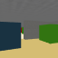

# MiniWorld DrStrategy - Multi-Room Maze Environment

A refactored implementation of Dr. Strategy's MiniWorld-based maze environments with updated dependencies and modern Python packaging. Based on the now-deprecated [MiniWorld](https://github.com/Farama-Foundation/Miniworld) project and the original [DrStrategy implementation](https://github.com/ahn-ml/drstrategy).

## Environment Observations

### Environment Views
Full environment layout and render-on-position views:

| Full Environment | Partial Top-Down Observations | Partial First-Person Observations |
|---|---|---|
|  |   |   |

## Installation

```bash
pip install miniworld-maze
```

## Usage

```python
from miniworld_drstrategy import create_nine_rooms_env

# Create environment
env = create_nine_rooms_env(variant="NineRooms", size=64)
obs, info = env.reset()

# Take actions
action = env.action_space.sample()
obs, reward, terminated, truncated, info = env.step(action)

env.close()
```

## Environment Variants

- **NineRooms**: 3×3 grid layout
- **SpiralNineRooms**: Spiral connection pattern  
- **TwentyFiveRooms**: 5×5 grid layout


## License

MIT License - see LICENSE file for details.